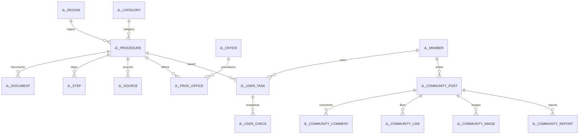

# Oracle DB 설명

실행 가능한 정확한 컬럼·자료형·제약조건은 `sql/01_create_tables.sql`이 기준입니다.
테이블 25개이며, 공통 안내·번역·회원별 준비 목록·일정·이메일 인증·커뮤니티를 저장합니다.

| 테이블 | 핵심 컬럼 | 용도 |
|---|---|---|
| JL_REGION | id, parent_id, name | 도쿄도 → 미나토구 |
| JL_CATEGORY | id, name | 생활 절차 분류 |
| JL_PROCEDURE | region_id, category_id, title, eligibility, situation, published, revision | 공통 절차 안내 |
| JL_DOCUMENT | procedure_id, name, requirement, condition_text, display_order | 서류와 적용 조건 |
| JL_DOCUMENT_GUIDE | document_id, language_code, description, preparation_note | 언어별 서류 설명·준비 방법 |
| JL_STEP | procedure_id, step_no, title, description | 서비스에서 정리한 순서 |
| JL_SOURCE | procedure_id, url, checked_on, updated_on | 출처·직접 확인일·출처 갱신일 |
| JL_OFFICE | name, address, homepage_url, note | 기관·창구 |
| JL_PROC_OFFICE | procedure_id, office_id | 절차-기관 다대다 연결 |
| JL_MEMBER | login_id, password_hash, display_name, email, email_verified, role, status | 회원·권한·활성 상태 |
| JL_EMAIL_VERIFICATION | email, code_hash, expires_at, verified_at, attempt_count | 회원가입·아이디 찾기 인증 |
| JL_PASSWORD_RESET | member_id, code_hash, expires_at, verified_at, attempt_count | 비밀번호 재설정 인증 |
| JL_USER_TASK | member_id, procedure_id, saved_revision, saved_title, status, memo, visit_date, completed_at | 후속 개인 절차 |
| JL_USER_CHECK | task_id, document_name, requirement, condition_text, checked | 저장 당시 서류 사본 |
| JL_USER_TASK_EVENT | task_id, member_id, event_date, title, memo, completed | 개인 일정 |
| JL_COMMUNITY_POST | member_id, category, title, body, status, view_count | 커뮤니티 게시글 |
| JL_COMMUNITY_COMMENT | post_id, member_id, body, status | 댓글 |
| JL_COMMUNITY_LIKE | post_id, member_id | 회원별 좋아요 |
| JL_COMMUNITY_IMAGE | post_id, stored_name, content_type, file_size | 게시글 이미지 메타데이터 |
| JL_COMMUNITY_REPORT | post_id/comment_id, member_id, reason, status | 게시글·댓글 신고 |

다국어 원문은 기존 일본어 컬럼을 유지하고 아래 번역 테이블에 `ko`·`en` 행을 추가합니다. 번역이 없는 경우에는 기존 일본어 원문을 표시하는 것을 기본 규칙으로 합니다.

| 번역 테이블 | 기준 테이블 | 번역 대상 |
|---|---|---|
| JL_PROCEDURE_I18N | JL_PROCEDURE | 절차명·요약·대상·기한·방법·주의 |
| JL_DOCUMENT_I18N | JL_DOCUMENT | 서류명·조건 |
| JL_STEP_I18N | JL_STEP | 단계명·설명 |
| JL_SOURCE_I18N | JL_SOURCE | 출처 제목 |
| JL_OFFICE_I18N | JL_OFFICE | 기관명·안내 |

번역 테이블 생성은 기존 데이터를 삭제하지 않는 `sql/03_create_translation_tables.sql`을 사용합니다. `01_create_tables.sql`과 `02_sample_data.sql`을 기존 Oracle 계정에서 다시 실행하지 않습니다.

## 설계 규칙

- 숫자 PK는 11g에서도 사용할 수 있도록 시퀀스로 생성합니다.
- 1~999는 초기 데이터용이며 새 데이터는 1000부터 시퀀스를 사용합니다.
- 일본어·한국어는 NVARCHAR2, SQL의 문자열 리터럴은 N 접두사를 사용합니다.
- 알 수 없는 주소·출처 수정일 등은 임의의 값 대신 NULL을 저장합니다.
- 기한은 원문 조건이 있는 설명으로 저장하고 자동 마감일 계산은 아직 하지 않습니다.
- 같은 사용자의 같은 절차 중복 저장을 UNIQUE(member_id, procedure_id)로 막습니다.
- 완료 상태에는 완료 시각이 필요하고, 미완료 상태에는 완료 시각이 없어야 합니다.
- 준비 서류는 REQUIRED/CONDITIONAL로 구분하고 조건부 서류에는 조건 설명이 필수입니다.
- 회원가입 시 비밀번호는 BCrypt 해시로 저장합니다. 초기 계정은 넣지 않습니다.
- 개인 체크 항목은 원본 서류를 참조하여 실시간 변하는 목록이 아니라 저장 시점의 사본입니다.
- 개인 체크가 바뀌어도 공통 서류와 다른 회원 데이터에 영향을 주지 않습니다.
- 개인 준비 기록 제거 시 연결 일정과 체크 항목도 같은 트랜잭션에서 제거합니다.
- 원본 절차는 일반적인 관리 작업에서 물리 삭제하지 않고 비공개 처리합니다.

## 초기 데이터

- 지역 2개: 도쿄도, 미나토구
- 분류 1개: 이사·주민등록
- 절차 19개: 전입·전거·전출·마이넘버·증명서·쓰레기·출산·육아·재류·상담·재난 안내
- 각 절차의 준비 서류·처리 단계·공식 출처와 일본어·한국어·영어 데이터
- 창구 그룹 1개: 총합지소 창구서비스계·다이바 분실
- 회원·개인 기록 0개

테스트의 가상 회원은 트랜잭션 안에서 만들고 롤백합니다.
위 숫자는 실제 지역 통계가 아닌, 이 프로젝트가 넣는 초기 레코드 수입니다.
